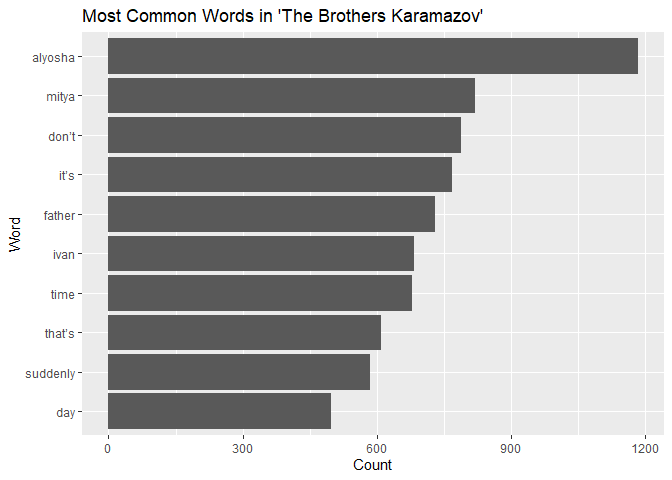
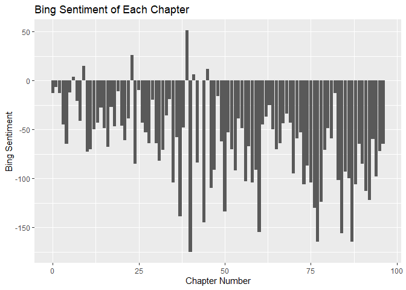

# The Brothers Karamazov Data Package
Casey Crary
2024-02-19

This file describes the `BrothersKaramazov` package.

This package allows easy analysis of “The Brothers Karamazov”, an
extremely influential work in Russian literature.

The BrothersKaramazov package can be installed by running:

    devtools::install_github("Casey308/BrothersKaramazov")
    library(BrothersKaramazov)

``` r
glimpse(karamazov_lines)
```

    Rows: 30,801
    Columns: 6
    $ gutenberg_id <int> 28054, 28054, 28054, 28054, 28054, 28054, 28054, 28054, 2…
    $ text         <chr> "The Brothers Karamazov", "Translated from the Russian of…
    $ linenumber   <int> 1, 2, 3, 4, 5, 6, 7, 8, 9, 10, 11, 12, 13, 14, 15, 16, 17…
    $ part         <int> 0, 0, 0, 0, 0, 0, 0, 0, 0, 0, 0, 0, 0, 0, 0, 0, 0, 0, 0, …
    $ book         <int> 0, 0, 0, 0, 0, 0, 0, 0, 0, 0, 0, 0, 0, 0, 0, 0, 0, 0, 0, …
    $ chapter      <int> 0, 0, 0, 0, 0, 0, 0, 0, 0, 0, 0, 0, 0, 0, 0, 0, 0, 0, 0, …

Here are some sample analyses:

``` r
karamazov_words <- karamazov_lines |>
  unnest_tokens(word, text) |>
  anti_join(stop_words, join_by("word")) |>
  count(word, sort = TRUE) |>
  mutate(word = reorder(word, n))

ggplot(data = head(karamazov_words, 10), aes(n, word)) +
  geom_col() +
  labs(x = "Count", y = "Word", title = "Most Common Words in 'The Brothers Karamazov'")
```



We can see from this that the three brothers, Alysoha, Mitya, and Ivan,
are all in the most common words in the novel. It also appears that time
is a central theme in the book, as “time,” “suddenly,” and “day,” all
relate to time in some way and are among the most prevalent words in the
novel.

``` r
karamazov_sentiments <- karamazov_lines |>
  unnest_tokens(word, text) |>
  anti_join(stop_words, join_by("word")) |>
  inner_join(get_sentiments("bing"), join_by("word")) |>
  count(chapter, sentiment) |>
  pivot_wider(names_from = sentiment, values_from = n, values_fill = 0) |>
  mutate(sentiment = positive - negative)

ggplot(karamazov_sentiments, aes(chapter, sentiment)) +
  geom_col(show.legend = FALSE) +
  labs(x = "Chapter Number", y = "Bing Sentiment",
       title = "Bing Sentiment of Each Chapter")
```



From this plot we can see that there are only 6 chapters that are more
positive than negative based on the Bing lexicon. This is slightly
surprising, as this is considered one of Dostoyevsky’s happier works.
